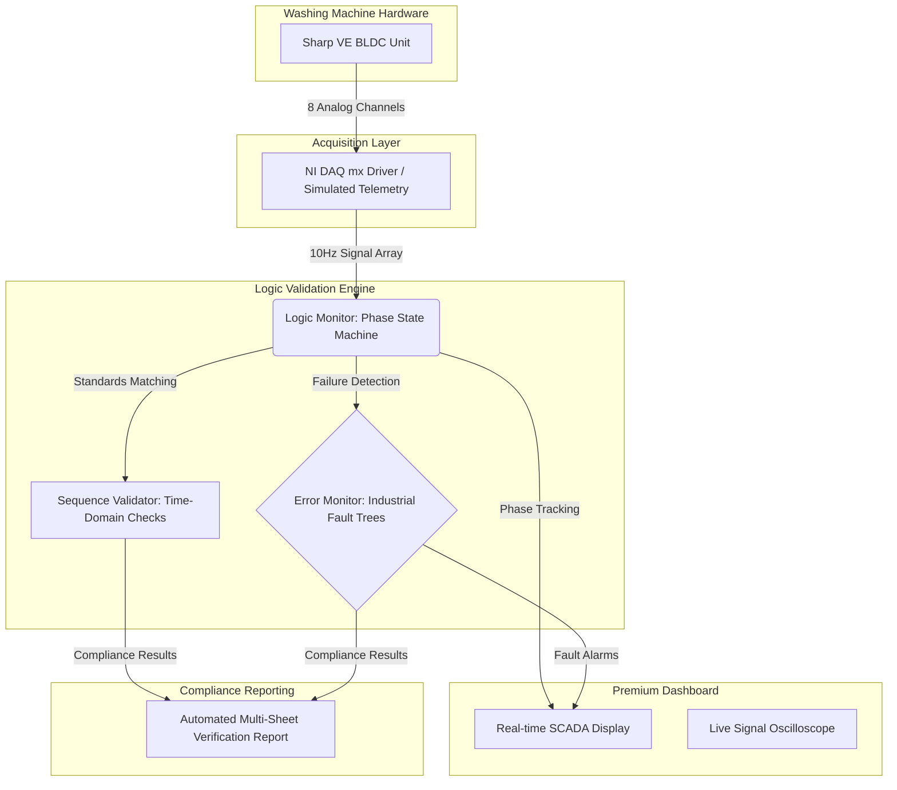
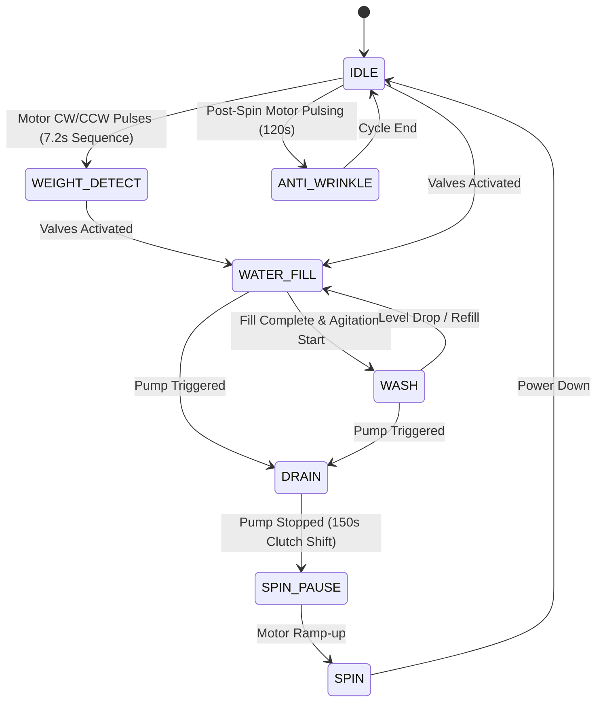

# SHARP VE BLDC Automated HIL DAQ System


##  Project Overview
The **SHARP VE BLDC Automated HIL DAQ System** is an industrial-grade Hardware-In-the-Loop (HIL) validation platform specifically engineered for the **Sharp VE BLDC 11kg/13kg** washing machine series. 

By sampling 8 critical electrical channels via an NI-DAQ card at a high-fidelity 10Hz, the system acts as an automated "Factory Auditor," verifying that the embedded software logic complies with 100% of the industrial timing specifications, safety protocols, and fault-tree responses defined by the Sharp engineering standards.

---

##  System Architecture

The software follows a **Clean Architecture** pattern, isolating hardware acquisition from the core validation engine and the premium visualization layer.



---

##  Enhanced State Machine Logic

The engine infers the machine's physical state using high-precision electrical heuristics, now supporting advanced BLDC phases:



---

##  Industrial Fault Tree Library (Sharp Standard)

The **ErrorMonitor** is now pre-loaded with the complete Sharp failure database, enabling automated bug detection across 10+ critical failure scenarios:

| Code | Fault Name | Validation Logic |
| :--- | :--- | :--- |
| **E1** | Drain Failure | Triggered if tub level doesn't reset within 15 minutes of pump activity. |
| **E2** | Lid Safety Fault | Immediate flag if lid is opened while high-speed spin or heating is active. |
| **E3-2** | Unbalance Failure | Detects if the machine fails to correct load unbalance after 3 refill attempts. |
| **E5** | Supply Failure | Flagged if target water level isn't reached within 20 minutes of valve opening. |
| **E6-1** | Overflow Fault | Safety breach if inlet valves and drain pump are active simultaneously for >5 min. |
| **E7-X** | Motor Rotation | Detects hall-sensor/inverter failures during wash (E7-1) or spin (E7-3). |
| **E9** | Leakage Fault | Triggered if water level drops unexpectedly during an active wash phase. |
| **EA** | Abnormal Water | Critical safety check: Water detected in tub during high-speed spin. |
| **Eb-1** | Motor Relay Stuck | Protects against motor relay fusing by detecting unplanned rotation at IDLE. |

---

##  Dynamic Configuration System

The system is 100% data-driven. All timing rules, program sequences, and error thresholds are parsed dynamically from `sharp_spec.json`. This allows the platform to support multiple machine variants (11kg vs 13kg) without any code changes.

- **12 Sharp BLDC Programs supported** (Regular, Quick, Heavy, Baby Care, etc.)
- **4 Water Levels per program** with dedicated timing curves.
- **Strict vs Max-Limit Validation**: Phases are evaluated against rigid factory tolerances.

---

##  Automated Reporting Engine

Upon hitting **STOP**, the engine generates a professional `.xlsx` compliance report:
1. **Analysis Summary**: Executive view showing PASS/FAIL status for every phase, with automated technical evidence and timestamps.
2. **Raw Telemetry**: 10Hz sampling history for deep-dive root cause analysis.

---

##  Installation & Hardware Setup

1. **Environment Setup:**
   ```bash
   pip install PyQt5 pyqtgraph pandas xlsxwriter nidaqmx qtawesome
   ```
2. **Hardware Configuration:** Connect your National Instruments DAQ unit. Channels are mapped according to the **Hardware IO** specs in `sharp_spec.json`.
3. **Execution:**
   ```bash
   python main.py
   ```

> **Safety Warning**: This system is designed for professional industrial environments. Ensure all high-voltage isolation protocols are followed when connecting the machine signals to the DAQ inputs.
