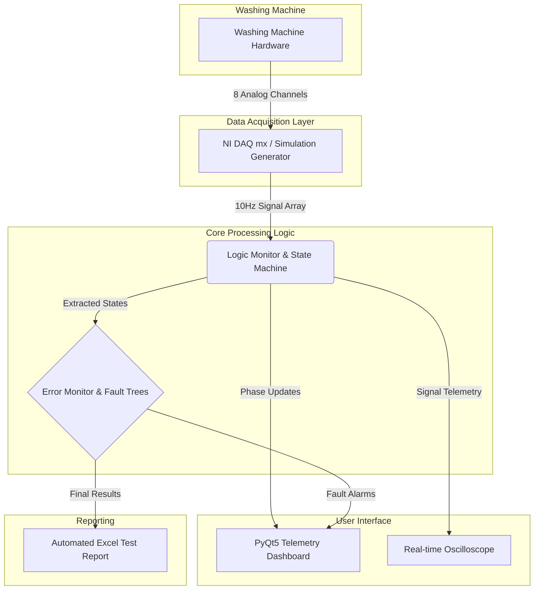
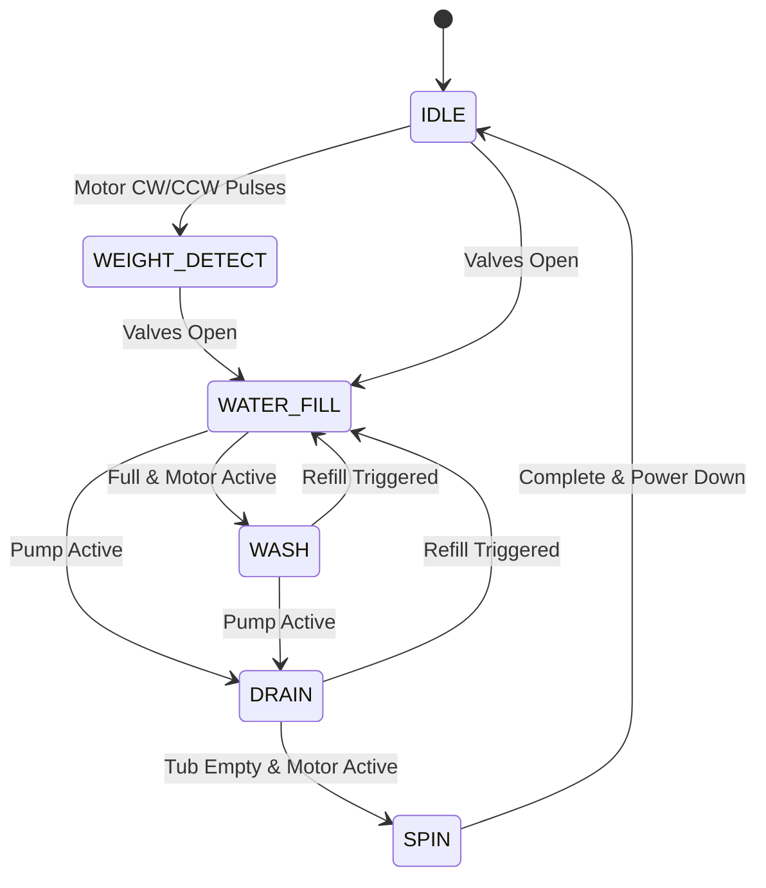
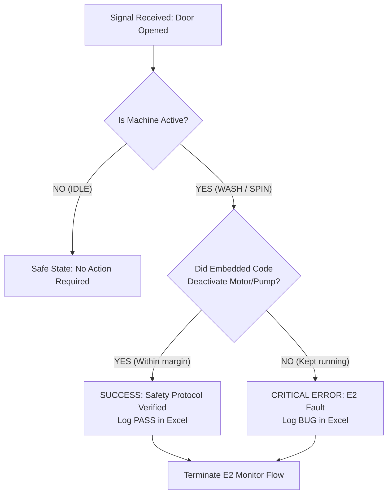

# SHARP VE BLDC Automated HIL DAQ System


##  Project Overview
The **SHARP VE BLDC Automated HIL DAQ System** is an enterprise-grade Hardware-In-the-Loop (HIL) testing and validation platform developed to ensure the absolute reliability and safety of the embedded software in industrial washing machines. 

By aggressively sampling 8 critical electrical channels via an NI-DAQ card at 10Hz, the platform translates raw high-voltage signals into a live, interactive logic dashboard. It serves as an uncompromising "Referee," evaluating the machine's state machine against international safety protocols and immediately flagging any deviations, timing violations, or hazardous conditions.

---

##  System Architecture

The software is built on a heavily decoupled architecture, isolating hardware data acquisition from UI rendering and logic evaluation.



---

##  Washing Machine State Machine

The application constantly infers the physical phase of the washing machine without any direct software communication, relying solely on electrical heuristics.



---

##  Fault Detection & Evaluation (Bug Hunting)

The system acts as an uncompromising safety protocol validator. Here is an example diagram representing the **E2 (Door Cover Fault)** validation logic:



### Supported Automated Error Detections:
1. **E2 Cover Door Fault**: Validates if the motherboard successfully triggers an emergency motor shutdown upon door opening.
2. **E1 Drain Timeout**: Validates if the pump completes the tub-drain sequence within regulatory time limits (15 minutes).
3. **E5 Water Supply Error**: Ensures water fill times out safely if valves remain open longer than the 20-minute safety threshold.
4. **Eb-1 Motor Continuous Running**: Prevents catastrophic motor relay fusing by ensuring a single motor pulse never exceeds 60 seconds.
5. **E7-4 Motor Short Circuit**: Hardware safeguard verifying CW and CCW signals are never simultaneously sent to the inverter.

---

##  User Interface Overview

The interface is designed with a premium, industrial SCADA aesthetic aimed at reducing operator fatigue during long testing shifts.

- **Dynamic Color Legend**: 
  - `IDLE (Grey)` | `WEIGHT (Orange)` | `WATER FILL (Soft Blue)` | `WASH (Soft Green)` | `DRAIN (Soft Red)` | `SPIN (Purple)`
- **True-to-Life Oscilloscope**: Graph signals are perfectly anchored to their zero-volt baselines, rendering a clean, mathematically accurate square-wave representation of the digital 5V triggers from the hardware.

---

##  Automated Reporting Engine

Upon test completion (Hitting STOP), the engine seamlessly compiles a multi-sheet `.xlsx` file:
1. `Test Summary`: High-level executive overview (Global PASS/FAIL, Duration, Total Rows, and isolated Failure Reasons/Bugs).
2. `Raw Data Logs`: The granular 10Hz sampling history of every connected channel, enabling micro-second bug tracing.

---

##  Installation & Usage

1. **Clone the repository:**
   ```bash
   git clone https://github.com/ziademad02153/WM-SHARP-BLCD-Automated-HIL-SYS.git
   cd WM-SHARP-BLCD-Automated-HIL-SYS
   ```
2. **Install dependencies:**
   ```bash
   pip install PyQt5 pyqtgraph pandas openpyxl nidaqmx qtawesome
   ```
3. **Execute System Configuration Extraction:**
   ```bash
   python extract_json.py
   ```
4. **Launch the DAQ Console:**
   ```bash
   python main.py
   ```

> **Note on Hardware Requirements**: To utilize the physical mode, an active National Instruments DAQ unit must be connected and recognized by the OS via NI-MAX. Otherwise, the software elegantly falls back to the chaotic `Simulation Mode` for logic robustness testing.
